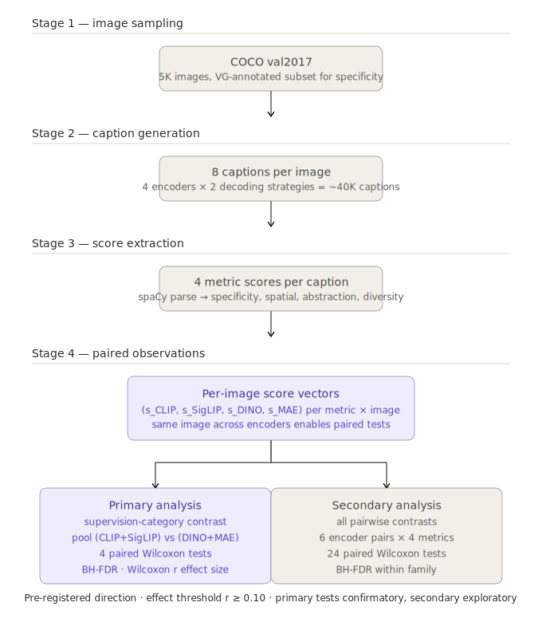

# TTIC Embeddings — Visual Encoder Swap → Caption Analysis

A controlled probe of how visual-encoder pretraining shapes generated captions. Four frozen visual encoders (CLIP, SigLIP, DINOv2, MAE) are compared under a fixed captioning architecture (frozen GPT-2 medium, lightweight prefix adaptor), holding training data, decoding, and metric definitions constant. The published writeup is [`encoder_pretraining_caption_report.tex`](encoder_pretraining_caption_report.tex). MIT-licensed; see [`LICENSE`](LICENSE).

**Authors.** Alex McMurtry (`amcmurtry@uchicago.edu`) and Hilman Hanivan (`hanivan@uchicago.edu`). Originally a TTIC course project; extended through a Phase A multi-seed analysis and peer-style reviewer passes into the form here.

**AI assistance.** Anthropic's Claude (via Claude Code) was used in creating all parts of this repository — code, documentation, configs, tests, and the LaTeX writeup. All design decisions, experimental choices, and final content were directed and reviewed by the human authors, who are responsible for the work.

**Headline finding (Phase A, three seeds):** with the language model, adaptor, and decoding fixed, the self-supervised DINOv2 encoder produces *more* projective spatial language and *longer* captions than the language-supervised CLIP and SigLIP. CLIP carries most of the pooled effect; SigLIP echoes it more weakly. The projective spatial direction matches the prediction pre-registered in [`docs/methods.md`](docs/methods.md); caption length was not pre-registered. MAE fails the comparable-quality precondition on both CIDEr and SPICE in every seed and is excluded from the headline contrast. Full writeup: [`encoder_pretraining_caption_report.tex`](encoder_pretraining_caption_report.tex) (build with `tectonic -X compile` to get the PDF).

## System overview



## Design documents

All design and operator documents live in [`docs/`](docs/):

- [`docs/methods.md`](docs/methods.md) — experimental design, metric definitions, pre-registered statistical analysis.
- [`docs/encoder_selection.md`](docs/encoder_selection.md) — 2×2 encoder rationale and confound matrix.
- [`docs/implementation_roadmap.md`](docs/implementation_roadmap.md) — phase-by-phase build plan (pre-execution).
- [`docs/RUN_PIPELINE.md`](docs/RUN_PIPELINE.md) — operator brief for the full end-to-end run.
- [`docs/RUN_PHASE_A.md`](docs/RUN_PHASE_A.md) — operator brief for the seed-aggregation follow-up.

## Quick start

We standardize on [`uv`](https://docs.astral.sh/uv/) for Python env management and [`make`](https://www.gnu.org/software/make/) for common workflows. Docker is supported for reproducible runs on cloud GPUs.

### Install uv

```bash
# macOS / Linux
curl -LsSf https://astral.sh/uv/install.sh | sh

# Windows (PowerShell)
powershell -ExecutionPolicy ByPass -c "irm https://astral.sh/uv/install.ps1 | iex"
```

### Local development

```bash
make install-dev    # uv sync --extra dev --extra caption-quality + NLTK assets (spaCy model via pyproject.toml)
make smoke          # Phase 0 verification: all four encoders load and produce expected shapes
make test           # Run the pytest suite (metrics, stats, adaptor, data)
```

If you don't have `make`, the equivalents are:

```bash
uv venv
uv pip install -e ".[dev,caption-quality]"
uv run python -m spacy download en_core_web_lg
uv run python -c "import nltk; nltk.download('wordnet'); nltk.download('omw-1.4')"
uv run python scripts/00_smoke_test.py
```

### Docker (reproducible builds with CUDA)

```bash
make docker-build   # CUDA-enabled image
make docker-smoke   # Phase 0 smoke test (CPU)
make docker-train   # GPU shell (needs nvidia-container-toolkit)
```

The container mounts `$COCO_ROOT`, `$VG_ROOT`, and your HuggingFace cache as volumes.

### Data download

```bash
export COCO_ROOT=/path/to/coco
export VG_ROOT=/path/to/vg
make data           # ~26 GB (COCO 25, VG attrs ~1)
```

## Reading the results

The committed data artifacts under `captions/` are gitignored locally but the published numerical results live in the report. To regenerate the PDF:

```bash
tectonic -X compile encoder_pretraining_caption_report.tex
```

To regenerate the numerical claims from raw captions, in pipeline order:

```bash
python scripts/05_score_metrics.py         # per-caption metrics
python scripts/06_analyze.py               # per-seed primary/secondary/mixed-effects
python scripts/07_probes.py                # frozen-encoder linear probes (object classification)
python scripts/08_caption_quality.py       # CIDEr + SPICE preconditions
python scripts/09_aggregate_seeds.py       # cross-seed robustness verdicts
python scripts/10_bootstrap_ci.py          # paired image-level bootstrap on Wilcoxon r
python scripts/11_permutation_test.py      # paired sign-flip permutation test
```

### JDK 11 requirement for caption quality

Script `08_caption_quality.py` invokes SPICE 1.0, which depends on the Nashorn JavaScript engine. Nashorn was removed from the JDK in version 15, so the script must run under JDK 11 (or earlier). Setting `JAVA_HOME=/usr/lib/jvm/java-11-openjdk-amd64` for that one invocation is sufficient; the rest of the pipeline doesn't touch Java. Without a compatible JDK the script silently reports `SPICE=n/a`.

## Layout

```
configs/                       # OmegaConf YAML — base + one per encoder
src/ttic_embeddings/
  encoders/                    # CLIP, SigLIP, DINOv2, MAE behind a common interface
  metrics/                     # caption-style metric implementations
  data/                        # COCO loader
  adaptor.py                   # MLP prefix adaptor
  generate.py                  # beam + nucleus decoding
  stats.py                     # Wilcoxon, primary/secondary families, mixed-effects
  train.py
  utils.py                     # seeding, logging
scripts/
  00_smoke_test.py             # Phase 0 verification
  01_cache_features.py         # Pre-extract frozen patch features
  01_download_data.py          # COCO + VG fetch
  02_train_adaptor.py          # Trains one prefix adaptor per encoder
  04_generate_captions.py
  05_score_metrics.py
  06_analyze.py
  07_probes.py
  08_caption_quality.py        # Requires JDK 11 (see above)
  09_aggregate_seeds.py
  10_bootstrap_ci.py
  11_permutation_test.py
  run_full_pipeline.sh
  run_phase_a.sh
tests/                         # pytest
docs/                          # design docs, operator briefs, pipeline diagram
  methods.md                   # pre-registered experimental design
  encoder_selection.md         # 2×2 encoder rationale and confound matrix
  implementation_roadmap.md    # pre-execution build plan (see also Phase A)
  RUN_PIPELINE.md              # operator brief for full end-to-end run
  RUN_PHASE_A.md               # operator brief for seed-aggregation follow-up
  data_and_analysis_pipeline.svg
encoder_pretraining_caption_report.tex   # full writeup
_ops/, logs/, pipeline.out     # historical operational logs from completed runs
```

`make help` lists all `## `-documented Makefile targets.
